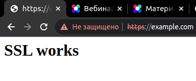

# 3.9. Элементы безопасности информационных систем

1. Установите Bitwarden плагин для браузера. Зарегистрируйтесь и сохраните несколько паролей.


2. Установите Google authenticator на мобильный телефон. Настройте вход в Bitwarden акаунт через Google authenticator OTP.


3. Установите apache2, сгенерируйте самоподписанный сертификат, настройте тестовый сайт для работы по HTTPS.



`/etc/apache2/sites-available/example.com.conf`:

```
<IfModule mod_ssl.c>
	<VirtualHost _default_:443>
		DocumentRoot /var/www/example.com

		ErrorLog ${APACHE_LOG_DIR}/error.log
		CustomLog ${APACHE_LOG_DIR}/access.log combined

		SSLEngine on
		SSLCertificateFile	/etc/ssl/certs/example.com.crt
		SSLCertificateKeyFile /etc/ssl/private/example.com.key
	</VirtualHost>
</IfModule>
```

Сертификаты сгенерированы командой:
```bash
sudo openssl req -x509 -nodes -days 365 -newkey rsa:2048 -keyout /etc/ssl/private/example.com.key -out /etc/ssl/certs/example.com.crt
```

4. Проверьте на TLS уязвимости произвольный сайт в интернете (кроме сайтов МВД, ФСБ, МинОбр, НацБанк, РосКосмос, РосАтом, РосНАНО и любых госкомпаний, объектов КИИ, ВПК ... и тому подобное).

```
 ./testssl.sh -U --sneaky https://habr.com/

 Testing vulnerabilities 

 Heartbleed (CVE-2014-0160)                not vulnerable (OK), no heartbeat extension
 CCS (CVE-2014-0224)                       not vulnerable (OK)
 Ticketbleed (CVE-2016-9244), experiment.  not vulnerable (OK)
 ROBOT                                     not vulnerable (OK)
 Secure Renegotiation (RFC 5746)           supported (OK)
 Secure Client-Initiated Renegotiation     not vulnerable (OK)
 CRIME, TLS (CVE-2012-4929)                not vulnerable (OK)
 BREACH (CVE-2013-3587)                    no gzip/deflate/compress/br HTTP compression (OK)  - only supplied "/" tested
 POODLE, SSL (CVE-2014-3566)               not vulnerable (OK)
 TLS_FALLBACK_SCSV (RFC 7507)              No fallback possible (OK), no protocol below TLS 1.2 offered
 SWEET32 (CVE-2016-2183, CVE-2016-6329)    VULNERABLE, uses 64 bit block ciphers
 FREAK (CVE-2015-0204)                     not vulnerable (OK)
 DROWN (CVE-2016-0800, CVE-2016-0703)      not vulnerable on this host and port (OK)
                                           make sure you don't use this certificate elsewhere with SSLv2 enabled services, see
                                           https://search.censys.io/search?resource=hosts&virtual_hosts=INCLUDE&q=23C599AB56B3C8DD6984AFE74F7BE26C88B8EDFD9C47F3B97808D9CFF159C8C4
 LOGJAM (CVE-2015-4000), experimental      not vulnerable (OK): no DH EXPORT ciphers, no DH key detected with <= TLS 1.2
 BEAST (CVE-2011-3389)                     not vulnerable (OK), no SSL3 or TLS1
 LUCKY13 (CVE-2013-0169), experimental     potentially VULNERABLE, uses cipher block chaining (CBC) ciphers with TLS. Check patches
 Winshock (CVE-2014-6321), experimental    not vulnerable (OK)
 RC4 (CVE-2013-2566, CVE-2015-2808)        no RC4 ciphers detected (OK)
```
5. Установите на Ubuntu ssh сервер, сгенерируйте новый приватный ключ. Скопируйте свой публичный ключ на другой сервер. Подключитесь к серверу по SSH-ключу.

Делаем две виртуалки:
```
Vagrant.configure("2") do |config|

  config.vm.define "first" do |first|
    first.vm.box = "bento/ubuntu-20.04"
    first.vm.network "public_network", bridge: "enp3s0"
  end

  config.vm.define "second" do |second|
    second.vm.box = "bento/ubuntu-20.04"
    second.vm.network "public_network", bridge: "enp3s0"
  end
end
```
openssh-server там уже установлен и запущен. Заходим на первую, генерируем ключи и копируем их на вторую виртуалку.
```bash
ssh-keygen
vagrant@vagrant:~$ ssh-keygen
Generating public/private rsa key pair.
Enter file in which to save the key (/home/vagrant/.ssh/id_rsa): 
Enter passphrase (empty for no passphrase): 
Enter same passphrase again: 
Your identification has been saved in /home/vagrant/.ssh/id_rsa
Your public key has been saved in /home/vagrant/.ssh/id_rsa.pub
The key fingerprint is:
SHA256:FIQDb5HwTt2AEabBktDQHwaP1sfPbta2sjB0cbVWfvk vagrant@vagrant
The key's randomart image is:
+---[RSA 3072]----+
|o=.++o=B+   . .  |
|  =++B=o + . +  .|
|  o++.B.+ o o ...|
| .  .= + o .   ..|
|      o S       E|
|     . o .       |
|      o + o      |
|       =.. .     |
|        .o.      |
+----[SHA256]-----+
vagrant@vagrant:~$ ssh-copy-id vagrant@192.168.0.18
/usr/bin/ssh-copy-id: INFO: Source of key(s) to be installed: "/home/vagrant/.ssh/id_rsa.pub"
/usr/bin/ssh-copy-id: INFO: attempting to log in with the new key(s), to filter out any that are already installed
/usr/bin/ssh-copy-id: INFO: 1 key(s) remain to be installed -- if you are prompted now it is to install the new keys
vagrant@192.168.0.18's password: 

Number of key(s) added: 1

Now try logging into the machine, with:   "ssh 'vagrant@192.168.0.18'"
and check to make sure that only the key(s) you wanted were added.

vagrant@vagrant:~$ ssh 'vagrant@192.168.0.18'
Welcome to Ubuntu 20.04.4 LTS (GNU/Linux 5.4.0-110-generic x86_64)

 * Documentation:  https://help.ubuntu.com
 * Management:     https://landscape.canonical.com
 * Support:        https://ubuntu.com/advantage

  System information as of Sat 01 Oct 2022 10:47:34 AM UTC

  System load:  0.07               Processes:             138
  Usage of /:   12.3% of 30.63GB   Users logged in:       1
  Memory usage: 11%                IPv4 address for eth0: 10.0.2.15
  Swap usage:   0%                 IPv4 address for eth1: 192.168.0.18


This system is built by the Bento project by Chef Software
More information can be found at https://github.com/chef/bento
Last login: Sat Oct  1 10:43:42 2022 from 10.0.2.2
vagrant@vagrant:~$ 
```

6. Переименуйте файлы ключей из задания 5. Настройте файл конфигурации SSH клиента, так чтобы вход на удаленный сервер осуществлялся по имени сервера.

```bash
sudo mv id_rsa new_id_rsa
sudo mv id_rsa.pub new_id_rsa.pub
```

Конфиг в `~/.ssh/config`:

```
Host second_vm
  HostName 192.168.0.18
  IdentityFile ~/.ssh/new_id_rsa
  User vagrant
```
7. Соберите дамп трафика утилитой tcpdump в формате pcap, 100 пакетов. Откройте файл pcap в Wireshark.

